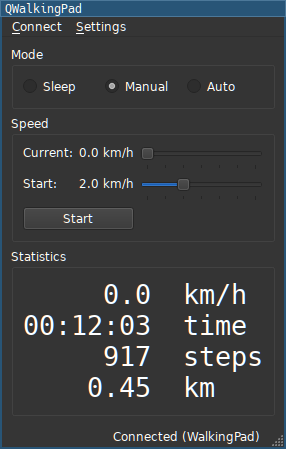

# QWalkingPad

Simple desktop application for controlling the [Kingsmith WalkingPad](https://walkingpad.com) over BLE (Bluetooth Low Energy).




- Control from command line while the application is running:
  - `qwalkingpad start`
  - `qwalkingpad addSpeed <speed>` (speed in 0.1 km/h)
  - `qwalkingpad setSpeed <speed>`
- Track statistics in CSV file.
- Set speed in 0.1 km/h increments (not possible with the [app](https://play.google.com/store/apps/details?id=com.walkingpad.app) or remote)
- (Maybe) cross-platform, written in C++ with Qt (only tested on Arch Linux with the WalkingPad A1 Pro).
- *eternal alpha*, contributions welcome
- Reverse engineered with love

## Build

Dependencies on Arch Linux: `qt5-base`, `qt5-connectivity` and the usual C++ development stuff (let me know if something is missing).

Clone with `--recursive` or use `git submodule init; git submodule update`.

```sh
mkdir build && cd build
cmake .. -DCMAKE_BUILD_TYPE=RELEASE
make -j
```
